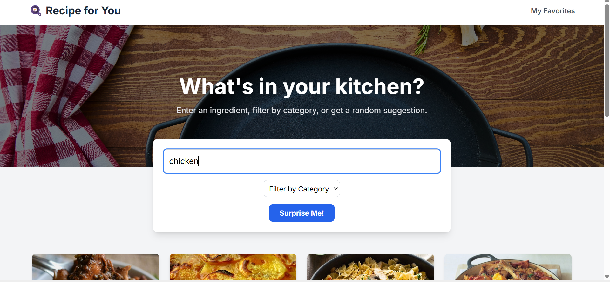

# 🍳 Recipe For You - A Recipe Finder App

A dynamic and responsive web application designed to help users discover recipe ideas based on ingredients, categories, or just a desire for something new.

**Live Demo Link:** (https://cookify-mu.vercel.app/)

---

## 📸 Screenshot



---

## 📖 About The Project

This application was built for a busy professional who needs a quick and easy way to find meal ideas. It provides a seamless user experience with features designed to make meal planning simple and fun, from searching for recipes to saving them for later.

---

## ✨ Features

- **Dynamic Ingredient Search:** Search for recipes using a single ingredient with a debounced input that provides instant results as you type.
- **Category Filtering:** Browse a wide range of recipes by category (e.g., "Seafood", "Dessert", "Vegetarian").
- **Random Recipe Generator:** A "Surprise Me!" feature for when you're feeling adventurous and want instant inspiration.
- **Favorites System:** Save and view favorite recipes using `localStorage` for persistent, client-side data storage.
- **Detailed Recipe View:** Click on any recipe to see a full list of ingredients and step-by-step instructions in a clean, two-column layout.
- **Modern UI/UX:** Built with a professional hero section, skeleton loaders for a smooth loading experience, toast notifications for user feedback, and a fully responsive design for all screen sizes.

---

## 🛠️ Technologies Used

- **React:** A JavaScript library for building user interfaces.
- **React Router:** For declarative routing and multi-page navigation.
- **Tailwind CSS:** A utility-first CSS framework for rapid UI development.
- **Framer Motion:** For subtle and elegant page and component animations.
- **TheMealDB API:** Used as the source for all recipe data.
- **React Hot Toast:** For user-friendly notifications.

---

## 🚀 How to Run Locally

1.  Clone the repository:
    ```bash
    git clone [https://github.com/your-username/your-repo-name.git](https://github.com/your-username/your-repo-name.git)
    ```
2.  Navigate to the project directory:
    ```bash
    cd your-repo-name
    ```
3.  Install dependencies:
    ```bash
    npm install
    ```
4.  Start the development server:
    ```bash
    npm start
    ```
